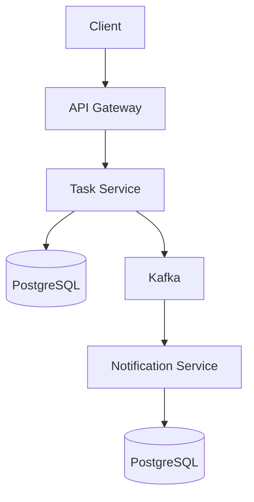
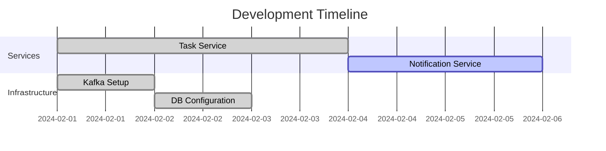

# **Product Requirements Document**  
**Todo Application with Event-Driven Architecture**  
**Version:** 1.0  
**Date:** 23.03.2025  

---

## **1. Product Overview**
A scalable todo application demonstrating microservices architecture with event-driven communication using Kafka. Designed to handle task management while decoupling core operations from downstream processes like notifications.

### **Key Objectives**
1. Demonstrate event-driven patterns in a distributed system
2. Enable horizontal scalability of services
3. Ensure reliable task tracking and event processing
4. Provide foundation for future extensions (analytics, reminders, etc.)

### **Target Audience**
- Technical interviewers evaluating system design skills
- Developers working with Go/Kafka
- Architects reviewing event-driven patterns

---

## **2. Features**

### **2.1 Core Features**
| Feature | Description | Service Owner |
|---------|-------------|---------------|
| Task Creation | Create todos with title/description | Task Service |
| Event Streaming | Emit "task_created" events to Kafka | Task Service |
| Event Consumption | Process events for notifications | Notification Service |
| Persistent Storage | PostgreSQL for both services | Both Services |

### **2.2 Event Types**
| Event | Payload | Trigger |
|-------|---------|---------|
| task_created | {id, title, timestamp} | New task creation |
| task_updated | {id, new_status} | Task modification |
| task_deleted | {id, reason} | Task deletion |

---

## **3. Technical Requirements**

### **3.1 Architecture Components**

### **3.2 Tech Stack**
| Component | Technology |
|-----------|------------|
| Language | Golang 1.21+ |
| Messaging | Apache Kafka 3.5+ |
| Databases | PostgreSQL 15+ (Dedicated per service) |
| Containerization | Docker 24.0+ |
| HTTP Framework | Gin/Gonic |
| ORM | GORM |
| API Format | JSON REST |

---

## **4. Non-Functional Requirements**

### **4.1 Performance**
| Metric | Target |
|--------|--------|
| API Response Time | <500ms (p95) |
| Event Processing Latency | <1s (p99) |
| Throughput | 1000 req/sec |

### **4.2 Reliability**
- 99.9% service uptime
- At-least-once event delivery semantics
- Dead-letter queue implementation for failed messages

### **4.3 Security**
- HTTPS for API endpoints
- JWT Authentication (Future Phase)
- Database credential encryption

### **4.4 Monitoring**
- Prometheus metrics integration
- Structured logging with Zap
- Kafka consumer lag monitoring

---

## **5. Milestones**

### **Phase 1: Core Implementation (Current)**

### **Phase 2: Future Extensions**
1. User Authentication Service
2. Task Reminder Subsystem
3. Analytics Dashboard
4. Mobile Push Notifications

---

## **6. Risks & Mitigation**

| Risk | Probability | Impact | Mitigation Strategy |
|------|-------------|--------|----------------------|
| Kafka message loss | Medium | High | Enable idempotent producer |
| Database schema mismatch | High | Medium | Schema versioning |
| Event ordering issues | Low | High | Single partition for demo |
| Service downtime | Medium | High | Health checks + Circuit breakers |

---

## **7. Dependencies**
1. Kafka cluster availability
2. Docker runtime environment
3. Go 1.21+ toolchain
4. PostgreSQL servers

---

## **8. Success Metrics**
1. **Code Quality**: <3% test coverage gap
2. **Scalability**: 5x throughput increase via horizontal scaling
3. **Reliability**: <0.1% message loss rate
4. **Interview Success**: Positive feedback on system design decisions

---

## **Appendices**

### **A. Glossary**
- **CDC**: Change Data Capture
- **DLQ**: Dead Letter Queue
- **SLA**: Service Level Agreement

### **B. References**
1. Confluent Kafka Documentation
2. Go Microservices Patterns
3. PostgreSQL ACID Compliance